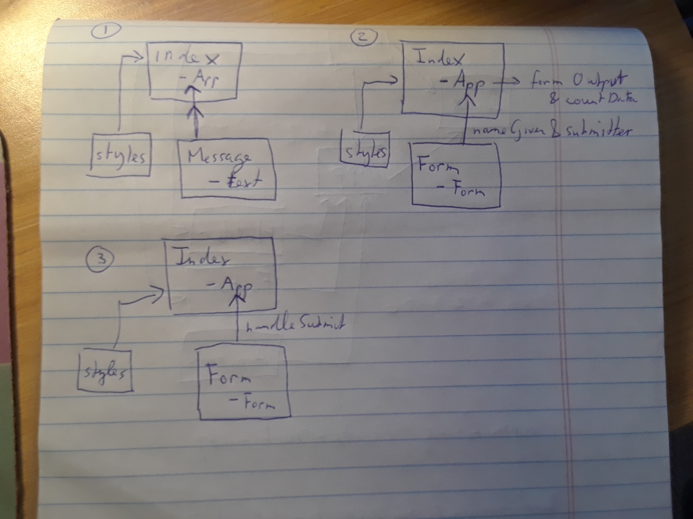

 LAB
=================================================

## Lab 28: Props and State

### Author: 
Trevor Stam

### Links and Resources
* [assignment 1](https://codesandbox.io/s/88y5w67lz8)
* [assignment 2](https://codesandbox.io/s/6v28vwmoyr)
* [assignment 3](https://codesandbox.io/s/kwnvxjnpmr)

### Modules
### Assignment 1
#### `index.js`
##### Exported Values and Methods
- class App
- `render()`

#### `message.js`
##### Exported Values and Methods
- class Message
- `render()`

### Assignment 2
#### `index.js`
##### Exported Values and Methods
- class App
- `getFormOutput(formOutput)`
- `countData(clicks)`
- `render()`

#### `form.js`
##### Exported Values and Methods
- class Form
-  `nameGiver(event)`
- `subMitter(event)`
- `render()`

### Assignment 3
#### `index.js`
##### Exported Values and Methods
- class App
- `handleSubmit(name)`
- `render()`

#### `form.js`
##### Exported Values and Methods
- class Form
- `render()`

#### UML

